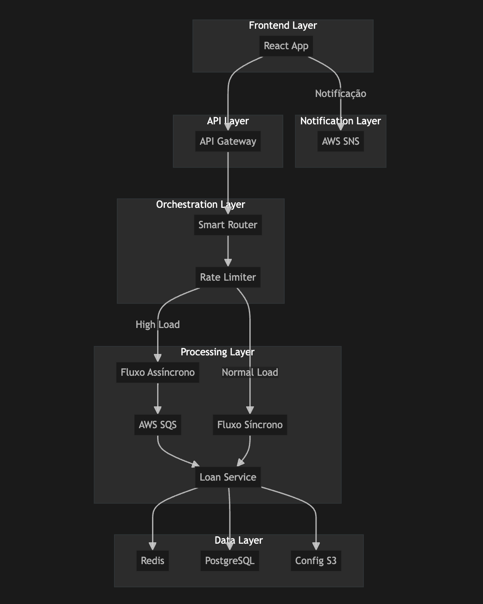

# Loan Simulator Service

Este é um serviço Spring Boot para simulação de empréstimos.

## Estrutura do Projeto

O projeto segue a arquitetura MVC (Model-View-Controller) com a seguinte estrutura de diretórios:

```
src/
  main/
    java/
      service/loansimulator/
        controller/    # Controladores REST
        model/        # Classes de modelo e DTOs
        service/      # Lógica de negócios
        exception/    # Tratamento de exceções
    resources/        # Arquivos de configuração
  test/
    java/
      service/loansimulator/
        controller/   # Testes dos controladores
        service/      # Testes dos serviços
```

## Tecnologias

- Java 21
- Spring Boot 3.2.3
- SpringDoc OpenAPI (Swagger)
- Resilience4j
- Lombok
- Maven

## Como Executar

1. Certifique-se de ter o Java 21 instalado
2. Execute o comando: `mvn spring-boot:run`
3. Acesse a documentação da API: `http://localhost:8080/swagger-ui.html`

## API Documentation

### Simulate Loan

**Endpoint:** POST `/api/v1/loan-simulator/simulate`

**Request Body:**
```json
{
  "loanAmount": 10000.00,
  "paymentTermInMonths": 12,
  "birthDate": "1990-01-01"
}
```

**Response:**
```json
{
  "totalAmount": 10150.00,
  "monthlyPayment": 845.83,
  "totalInterest": 150.00,
  "annualInterestRate": 3.00
}
```

### Interest Rates

As taxas de juros são determinadas pela idade do cliente:
- Até 25 anos: 5% ao ano
- 26 a 40 anos: 3% ao ano
- 41 a 60 anos: 2% ao ano
- Acima de 60 anos: 4% ao ano

## Testing

O projeto inclui cobertura abrangente de testes usando frameworks modernos:

### Test Stack
- JUnit 5 para execução e gerenciamento do ciclo de vida dos testes
- AssertJ para assertions fluentes
- Mockito para mock de dependências
- Spring Test para testes de integração

### Categorias de Testes
1. **Service Tests** (`LoanSimulatorServiceTest`):
   - Precisão dos cálculos
   - Determinação da taxa de juros
   - Validação de entrada
   - Casos de borda

2. **Controller Tests** (`LoanSimulatorControllerTest`):
   - Validação de requisições
   - Mapeamento de respostas
   - Códigos de status HTTP
   - Cenários de erro

3. **Exception Handler Tests** (`GlobalExceptionHandlerTest`):
   - Exceções customizadas
   - Erros de validação
   - Rate limiting
   - Erros genéricos

### Executando os Testes

Execute todos os testes com:
```bash
mvn test
```

Gere o relatório de cobertura de testes:
```bash
mvn verify
```

O relatório de cobertura estará disponível em: `target/site/jacoco/index.html`

## Requirements

- Java 21
- Maven

## Setup

1. Clone o repositório
2. Build do projeto:
```bash
mvn clean install
```
3. Execute a aplicação:
```bash
mvn spring-boot:run
```

A aplicação iniciará na porta 8080.

## Visão Geral da Arquitetura

O sistema foi projetado utilizando uma arquitetura em camadas (layered architecture) com padrões de microsserviços, garantindo escalabilidade e facilidade de manutenção.

### Desenho da Arquitetura



#### Componentes e Interações:

##### Frontend Layer (React App)
- Interface do usuário
- Validação inicial de dados
- Exibição de resultados
- Envia requisições para o API Gateway
- Realiza polling para simulações assíncronas
- Recebe notificações do SNS

##### API Layer (AWS API Gateway)
- Ponto de entrada único
- Roteamento, autenticação, rate limiting
- Encaminha requisições para a camada de orquestração

##### Orchestration Layer
- Smart Router + Rate Limiter
- Rate Limiter: Controla o fluxo de requisições baseado em limites configuráveis
- Smart Router: Escolhe entre processamento síncrono ou assíncrono baseado na carga atual
- Monitora métricas de sistema (CPU, memória, fila SQS)
- Implementa estratégias de balanceamento de carga

##### Processing Layer (Java 21 + Spring Boot)
- Fluxo Síncrono: Processa simulações de baixa carga diretamente
- Fluxo Assíncrono: Envia para AWS SQS quando excede limites do rate limiter
- Consome mensagens da fila para simulação assíncrona
- Notifica conclusão via SNS
- Processamento paralelo de cálculos complexos
- Otimização de performance com Virtual Threads (Java 21)
- Cache inteligente de resultados frequentes

##### Data Layer
- PostgreSQL: dados transacionais e histórico de simulações
- Redis: cache para simulações e sessões de usuário
- S3: configurações de taxas, políticas e backups

##### Notification Layer (AWS SNS)
- Envia notificações sobre finalização de simulação assíncrona
- Integração com frontend para atualização em tempo real

### Justificativas Tecnológicas

#### Frontend - React
- Virtual DOM e componentização para manutenção
- TypeScript para evitar bugs e melhor developer experience

#### API Gateway - AWS
- Gerenciamento de segurança e versionamento centralizados
- Escalabilidade e monitoramento nativos
- Rate limiting nativo integrado

#### Rate Limiter Strategy
- Algoritmo Token Bucket: Permite rajadas controladas
- Métricas dinâmicas: Ajuste baseado em carga do sistema

#### PostgreSQL
- Suporte a ACID, consultas complexas e alta confiabilidade
- Particionamento para grandes volumes de dados

#### Redis
- Alta performance com latência sub-milissegundo
- Suporte a estruturas de dados complexas para cache

#### AWS SQS
- Garantia de entrega e escalabilidade automática
- Dead Letter Queue para tratamento de falhas

#### AWS SNS
- Notificações multi-canal e assíncronas
- Integração com múltiplos protocolos

### Padrões de Projeto e Boas Práticas

#### Padrões Arquiteturais
- Rate Limiter Pattern: Controla fluxo de requisições e previne sobrecarga
- BFF (Backend for Frontend): Agrega dados de múltiplos serviços
- CQRS Simplificado: Comando e leitura separados (PostgreSQL e Redis)
- Repository Pattern: Abstração do acesso aos dados
- Observer Pattern: Para notificações assíncronas

#### Estratégia de Rate Limiting

##### Configuração do Rate Limiter:
- Limite por usuário: 10 requisições/minuto
- Limite global: 1000 requisições/minuto
- Threshold para processamento assíncrono: 80% da capacidade
- Algoritmo: Token Bucket com refill rate configurável

##### Lógica de Decisão:
```java
if (current_load < sync_threshold && tokens_available) {
    process_synchronously()
} else {
    queue_for_async_processing()
}
```

#### Autenticação e Autorização
- JWT para autenticação
- RBAC (Role-Based Access Control) para permissões
- Integração com AWS Cognito ou OAuth
- Rate limiting por nível de usuário (premium vs standard)

### Considerações de Escalabilidade e Performance

#### Escalabilidade
- Rate Limiter distribuído usando Redis para coordenação
- SQS para desacoplar processos e absorver picos de carga
- Auto scaling nos serviços de backend baseado em métricas
- Cache em Redis para reduzir acessos ao banco
- Horizontal scaling com load balancers
- Database sharding para grandes volumes

#### Otimização de Performance
- Processamento paralelo para cálculos complexos
- Uso de Virtual Threads (Java 21) para operações I/O
- Cache inteligente com políticas de invalidação
- Computação assíncrona de taxas de juros
- Cálculo paralelo de valores de pagamento
- Operações não-bloqueantes quando possível
- Bulk processing para múltiplas simulações
- Warm-up do cache em horários de pico

## Recursos de Resiliência

A aplicação inclui diversos padrões de resiliência:

1. **Circuit Breaker**: Previne sobrecarga do sistema
2. **Rate Limiting**: Controla taxa de requisições
3. **Bulkhead**: Isola falhas
4. **Retry**: Lida com falhas transitórias

Monitore esses recursos através dos endpoints do actuator:
```
http://localhost:8080/actuator/health
http://localhost:8080/actuator/metrics
``` 